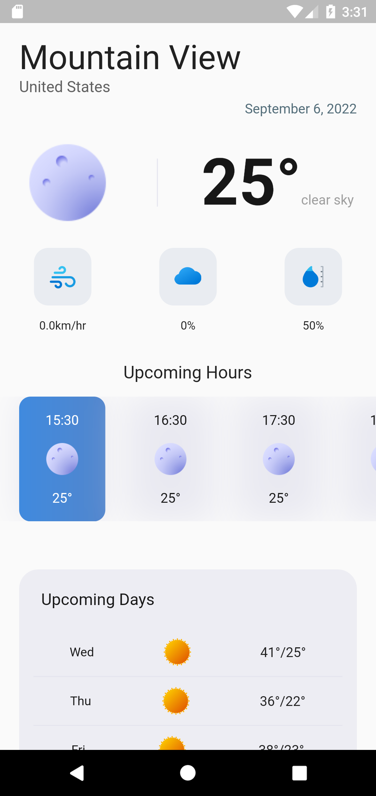
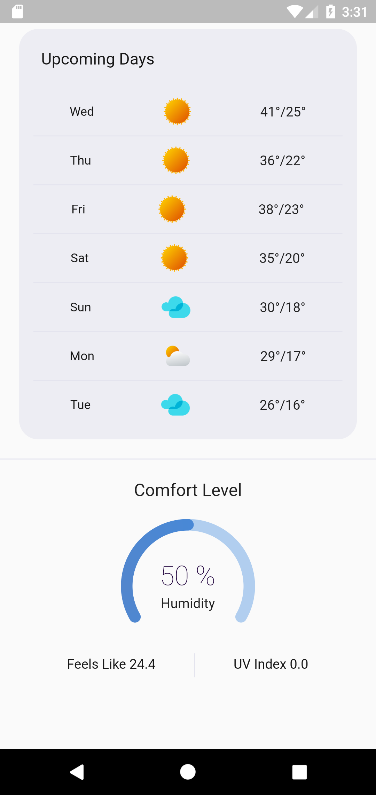

# Flutter Weather Applicaton

A new Flutter project for weather forecast for your current location.  

## Features

A functional app that provides details around weather conditions. Features:

* Simple & functional interface
* [OpenWeatherMap API](https://openweathermap.org/api/one-call-3) data with GET request
* Sleek Circular Slider for data
* Weather forecast for current, hourly and daily

## Dependencies

* [Geocoding](https://pub.dev/packages/geocoding)
* [Geolocator](https://pub.dev/packages/geolocator)
* [Getx](https://pub.dev/packages/get)
* [http](https://pub.dev/packages/http)
* [intl](https://pub.dev/packages/intl)
* [Sleek Circular Slider](https://pub.dev/packages/sleek_circular_slider)

 ## Snapshots
 &nbsp;  

For help getting started with Flutter development, view the
[online documentation](https://docs.flutter.dev/), which offers tutorials,
samples, guidance on mobile development, and a full API reference.
